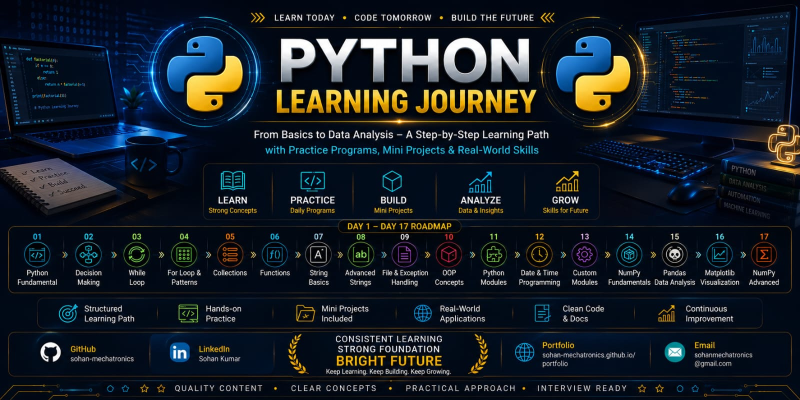

<p align="center">
  
</p>

---
# 🐍 Python Learning Journey

A comprehensive repository documenting my Python learning journey from programming fundamentals to data analysis and visualization.

This repository contains structured notes, practice programs, mini projects, and hands-on exercises developed while learning Python programming. The goal is to strengthen problem-solving skills, programming logic, and practical implementation of software development concepts.

---

## 📖 About This Repository

This repository serves as a personal learning archive and showcases my progress in Python programming through organized topic-wise practice and project development.

The learning path covers:

* Python Fundamentals
* Programming Logic Building
* Object-Oriented Programming
* File Handling
* Data Analysis
* Data Visualization
* Mini Projects
* Problem Solving

---

## 🎯 Learning Objectives

* Develop strong programming fundamentals
* Improve logical thinking and problem-solving skills
* Learn software development best practices
* Understand data analysis workflows
* Build practical Python applications
* Prepare for advanced technologies such as AI, Robotics, Automation, and Data Science

---

## 📚 Topics Covered

### Python Fundamentals

* Variables and Data Types
* Operators
* Input and Output
* Type Conversion

### Control Flow

* Decision Making (if, elif, else)
* While Loop
* For Loop
* Pattern Programming

### Data Structures

* Lists
* Tuples
* Sets
* Dictionaries

### Functions and Modular Programming

* User Defined Functions
* Function Arguments
* Return Statements
* Custom Modules

### String Programming

* Basic String Operations
* Advanced String Manipulation
* Pattern Matching

### File and Exception Handling

* File Reading and Writing
* Error Handling
* Exception Management

### Object-Oriented Programming (OOP)

* Classes and Objects
* Constructors
* Inheritance
* Polymorphism
* Encapsulation

### Python Libraries

* NumPy Fundamentals
* Advanced NumPy
* Pandas Data Analysis
* Matplotlib Visualization

### Date and Time Programming

* Date Handling
* Time Manipulation
* Datetime Module

---

## 🛠️ Mini Projects

The repository includes several beginner-to-intermediate projects:

* 🧮 Calculator System
* 🏧 ATM Management System
* 🔐 Login Authentication System
* 🎯 Number Guessing Game
* 🎓 Student Management System
* 👥 Multiple Student Record System

These projects helped reinforce programming concepts through practical implementation.

---

## 📂 Repository Structure

```text
01_Python_Fundamental
02_Decision_Making
03_While_Loop
04_For_Loop_Patterns
05_Collections
06_Functions
07_String_Basics_Programs
08_Advanced_String_Programs
09_File_And_Exception_Handling
10_Object_Oriented_Programming(OOP)
11_Python_Modules
12_Date_Time_Programming
13_Custom_Modules
14_NumPy_Fundamentals
15_Pandas_Data_Analysis
16_Matplotlib_Visualization
17_NumPy_Data_Analysis(Advanced)

Mini_Projects
Resources
```

---

## 🚀 Skills Demonstrated

Through this repository, the following technical skills were developed:

* Python Programming
* Problem Solving
* Algorithmic Thinking
* Object-Oriented Programming
* File Handling
* Exception Handling
* Data Analysis
* Data Visualization
* Software Development Fundamentals
* Git & GitHub Version Control

---

## 📈 Future Learning Roadmap

Planned topics for future learning:

* Advanced Python
* Data Science
* Machine Learning
* Artificial Intelligence
* Computer Vision
* Robotics Programming
* Automation Scripting
* IoT Development

---

## 📸 Repository Preview

Add screenshots of projects and outputs here.

Example:

```md

```

---

## 👨‍💻 Author

**Sohan Kumar**

* B.Tech Mechatronics Engineering Student
* Diploma in Electrical Engineering
* Chandigarh University

### Areas of Interest

* Robotics
* Industrial Automation
* PLC & SCADA
* Embedded Systems
* Artificial Intelligence
* Python Programming
* Mechatronics Engineering

---

## 🤝 Contributions

This repository is continuously updated as part of my learning and professional development journey.

Suggestions and improvements are always welcome.

---

⭐ If you found this repository useful, consider giving it a star.